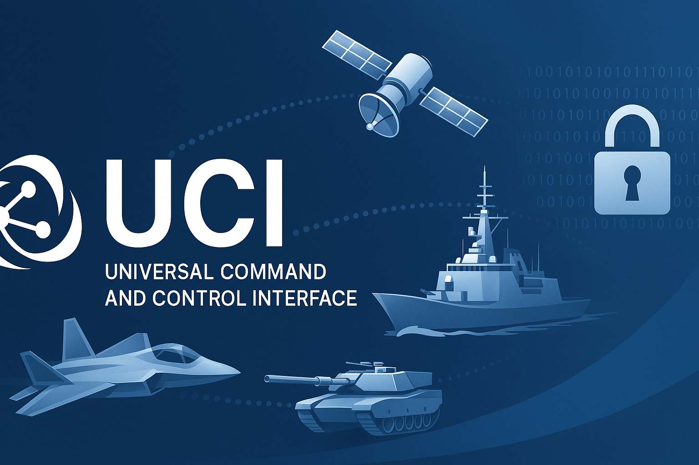
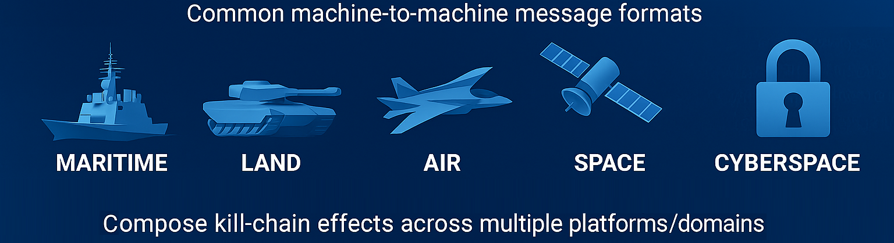

   

Welcome to the official unclassified repository for the Universal Command and Control (C2) Interface (UCI) Standard, a government‑owned, non‑proprietary open architecture specification enabling mission‑level machine‑to‑machine C2 across heterogeneous systems. This repository contains the complete UCI Definition & Documentation (D&D) set for UCI Version 2.5, released 22 January 2026.

The UCI standard provides a common message definition for performing mission operations and enables C2 coordination across sensors, vehicles, data products, and software components.

> [!NOTE]
> This repository focuses exclusively on the technical standard and documentation. Example "hello world" software implementation code is forthcoming.

## 🚀 Overview

The UCI standard defines a messaging architecture that enables interoperable, mission‑level command and control across multi‑domain systems — air, land, sea, space, and cyberspace.  It includes:

- Message definitions (via the UCI Schema)
- Interaction patterns (via the Normalized Interface Specification)
- Schema design rules (via the Schema Style & Design Specification)
- Compliance expectations for adopting programs

The UCI standard supports both command/control messages and situational awareness/data messages.  It is intentionally technology‑agnostic — it does not prescribe hardware, operating system, encoding, or transport protocols, allowing programs to adopt modern technologies without breaking interoperability.

## 📊 Why UCI?

The UCI standard is designed to support the need for rapid, interoperable, multi‑domain mission execution. The standard emphasizes:

- **Interoperability Across Platforms**: UCI enables seamless data exchange across heterogeneous systems.
- **Modularity & Flexibility**:  Programs can adopt only the messages they need using Message Sets and Program Schemas.
- **Technology Independence**:  UCI avoids locking programs into specific encodings or transports.
- **Support for Modern Mission Needs**:  Multi‑domain operations, machine‑to‑machine C2, situational awareness, secure messaging
- **Reduced Integration Risk**:  Common message definitions reduce ambiguity and integration cost.

UCI is a "living standard," evolving to meet mission needs while ensuring backward compatibility where possible—making it a future-proof foundation for mission-critical systems.

## 📦 What's Included in the Standard

This repository includes all documents comprising the UCI Version 2.5.  The heart of the standard is the UCI message schema located at [UCI/OAC-STD-UCI_V2.5/UCI_MessageDefinitions_v2_5_0.xsd](https://github.com/modular-af/UCI/blob/main/OAC-STD-UCI_V2.5/UCI_MessageDefinitions_v2_5_0.xsd).

## 🧭 Where to Find More Information

- **Official Governance**: Visit the Open Architecture Collaborative Working Group (OACWG) for updates and governance details. Contact via <aflcmc.ase.architectures@us.af.mil>.
- **Related Standards**: The UCI standard is leveraged by a variety of open architectures including [Open Mission Systems (OMS)](https://github.com/modular-af/OMS).
